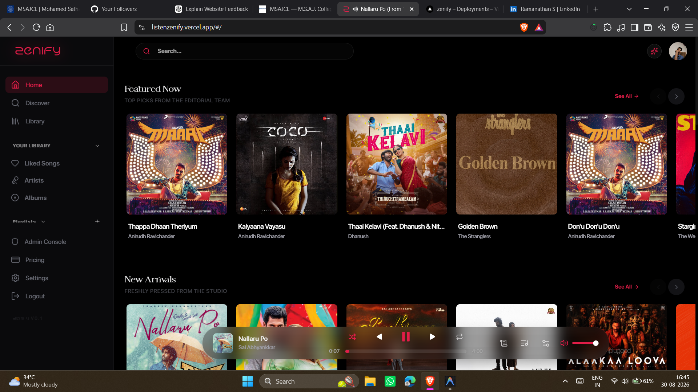
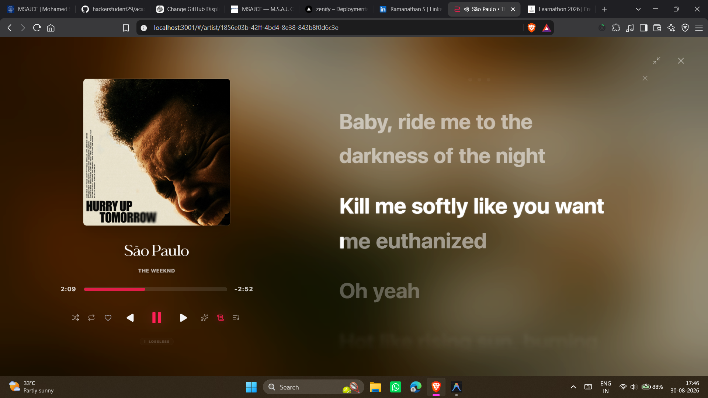
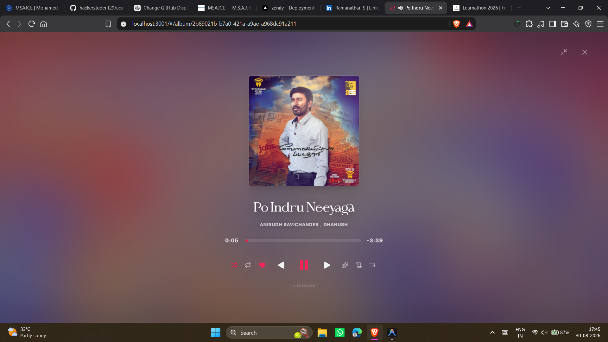
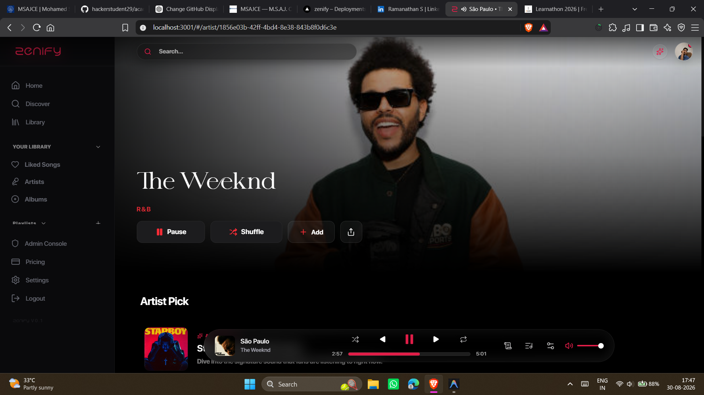
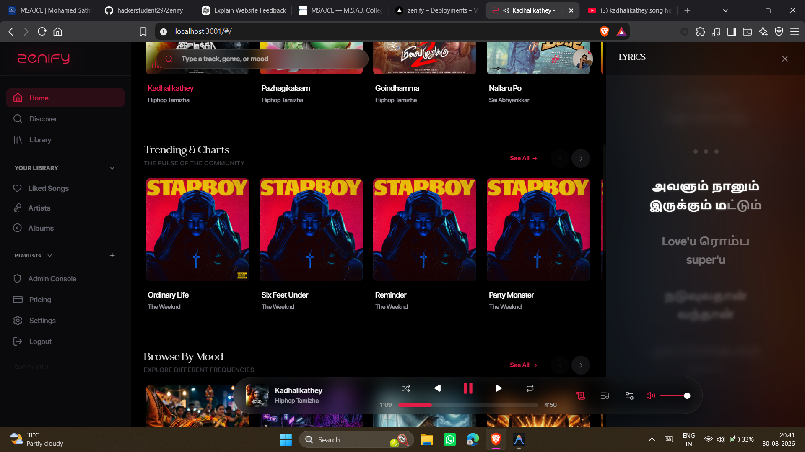
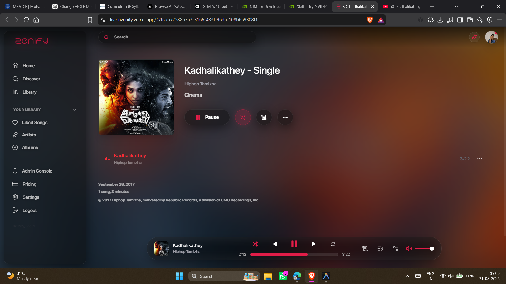
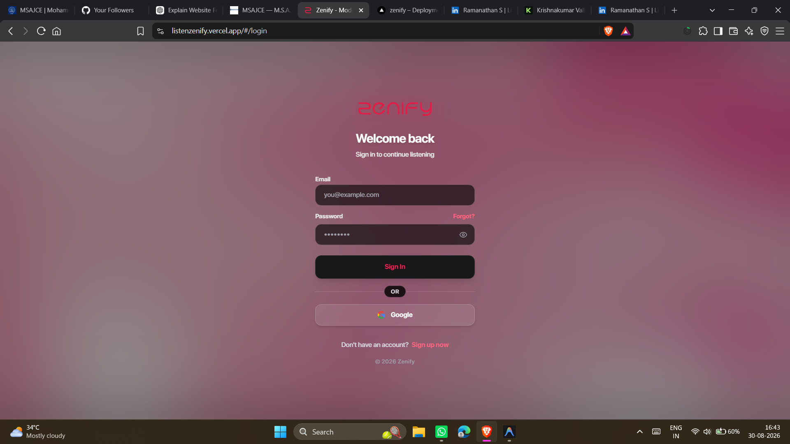
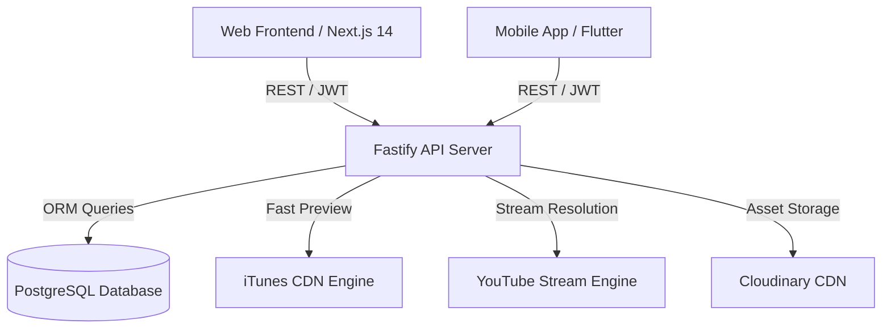

<div align="center">
  <br />
  <a href="https://listenzenify.vercel.app">
    
  </a>
  <br />
  <br />
  <h1>🎵 Zenify – Free Music Streaming App & Open-Source Spotify Alternative</h1>
  <p>
    <b>Next-Generation Full-Stack Web & Mobile Audio Streaming Platform</b><br/>
    <em>Ultra-fast iTunes CDN audio engine, AI synchronized lyrics, Liquid Glass UI, and native Flutter mobile app.</em>
  </p>

  <p>
    <a href="https://listenzenify.vercel.app"></a>
    <a href="https://github.com/hackerstudent29/Zenify"></a>
    
    
    
    
    
  </p>

  <p>
    <em>Engineered for audiophiles, creators, and developers by <a href="https://github.com/hackerstudent29"><b>hackerstudent29</b></a>.</em>
  </p>
</div>

---

## ⚡ Project Overview

**Zenify** is a production-grade, high-performance web and mobile music streaming app designed as a modern, lightweight alternative to commercial platforms like Spotify and Apple Music. Built with **Next.js 14 App Router**, **Fastify**, **Prisma ORM**, and **Flutter**, Zenify features real-time audio stream resolution, interactive AI synchronized lyrics, ambient color auras, and native mobile background audio playback.

---

## ✨ Key Features & Capabilities

### ⚡ Fast Audio Stream & iTunes CDN Resolution
* **Sub-50ms Fast Preview Engine:** Resolves direct high-quality AAC streams instantly from iTunes CDN without expensive stream transcoding bottlenecks.
* **YouTube Stream Fallback & Range Seeking:** Native HTTP 206 Partial Content range seeking via `/stream-youtube` proxy with stream container header preservation (`ftyp`/`EBML`) for seamless HTML5 `<audio>` demuxing.

### 🎤 High-Precision AI Synchronized Lyrics Engine
* **Acoustic Syllable Alignment:** Analyzes phonetic vowel structures across English, Tamil, Tanglish, Hindi, and Malayalam to generate sub-second accurate synchronized timing (`[mm:ss.xx]`).
* **Instrumental Gap Protection:** Automatically detects non-vocal sections (`[Guitar Solo]`, `[BGM]`, `[Outro]`) to prevent line stretching during instrumental breaks.
* **Interactive Lyrics Studio:** Real-time Karaoke Painter view, manual segment adjustment, and global time-shift utilities.

### 📱 Native Flutter Mobile Application
* **Glassmorphic Floating Player:** Translucent floating oval miniplayer with `BackdropFilter` heavy blur and translucency.
* **3D Flip Card:** Smooth 90-degree 3D card flip between dynamic album artwork and synchronized scrolling lyrics.
* **Offline Local Music Player:** Integrated native file scanner for playing local `/Music` and `/Download` files offline.
* **Kotlin AudioServiceActivity:** Hooks into Android system audio framework for persistent background playback, lock-screen notification controls, and Bluetooth media keys.

### 🛡️ Enterprise Security & Performance
* **End-to-End JWT Auth & Refresh Tokens:** HTTP-only secure cookie rotation.
* **Strict Rate-Limiting & Security Headers:** `@fastify/rate-limit` DDoS protection and Helmet security directives.
* **Data Sanitization & Injection Defense:** Parameterized Prisma query engine + Zod input validation schemas.

---

## 📸 Interface Showcase & Gallery

<div align="center">

### 🎵 Main Home Dashboard & Glass Miniplayer


<br/>

| 🎤 AI Synchronized Lyrics | 🔮 Fullview Ambient Aura Player |
| :---: | :---: |
|  |  |

<br/>

| 🌟 Artist Spotlight & Discography | 📜 Tamil & Multi-Lingual Lyrics Drawer |
| :---: | :---: |
|  |  |

<br/>

| 🎧 Track Page & Color Aura | 🔑 Secure Auth & Login Screen |
| :---: | :---: |
|  |  |

</div>

---


## 🏗️ System Architecture



---

## 💻 Tech Stack

| Domain | Technology | Purpose |
| :--- | :--- | :--- |
| 🌐 **Web Frontend** | `Next.js 14`, `React 18`, `TypeScript` | Server-side rendering, App Router, responsive web player. |
| 📱 **Mobile App** | `Flutter (Dart)`, `Kotlin` | Cross-platform mobile app with background audio daemon. |
| 🎨 **UI / Styling** | `Tailwind CSS`, `Framer Motion`, `Lucide Icons` | Glassmorphism, liquid UI, color aura extraction. |
| 🚀 **Backend API** | `Fastify`, `TypeScript`, `Node.js` | High-performance API server with `@fastify/rate-limit`. |
| 🗄️ **Database** | `PostgreSQL`, `Prisma ORM` | Relational schema modeling and type-safe query building. |
| 🔒 **Security** | `Bcrypt`, `JSON Web Tokens (JWT)`, `Zod` | Encrypted passwords, cookie rotation, input sanitization. |

---

## 🚀 Quick Start (Local Development)

### 1. Prerequisites
- Node.js 18+ & npm
- PostgreSQL database
- Flutter SDK (optional, for mobile build)

### 2. Backend Setup
```bash
cd backend
npm install
npx prisma generate
npm run dev
```

### 3. Frontend Setup
```bash
cd frontend
npm install
npm run dev
```

Visit `http://localhost:3000` to access the web player.

---

## 💖 Support the Developer & Sponsor Zenify (UPI)

**Zenify** is built with passion as a 100% free, ad-free, open-source audio streaming platform by a solo developer (**Ram / hackerstudent29**). 

Running and scaling Zenify requires recurring domain renewals, backend cloud server infrastructure, and relentless development hours. Beyond code, Ram relies on this project to support his family and maintain independent software engineering full-time.

If Zenify brought joy to your music experience, please consider sponsoring or sending a contribution to keep the project alive!

### 📱 Send Support via Indian UPI (GPay / PhonePe / Paytm / BHIM)
* **UPI ID:** `ramanathanb86@oksbi`
* **Supported Apps:** Google Pay (GPay), PhonePe, Paytm, BHIM, Amazon Pay, & all Indian Bank UPI apps.
* **Purpose:** Domain name renewals (`listenzenify.com`), server hosting fees, and supporting the developer's family.

> *"Every contribution—big or small—helps keep our servers running, pays for domain renewals, and supports a developer working hard to care for his family through open-source software."*

---

## 💼 Commercial Services & Consulting

Need a custom music streaming platform, AI audio synchronization tool, or high-performance Next.js application?

- 🌐 **Live Demo:** [listenzenify.vercel.app](https://listenzenify.vercel.app)
- 👨‍💻 **Developer:** [github.com/hackerstudent29](https://github.com/hackerstudent29)
- 💳 **UPI Sponsor ID:** `ramanathanb86@oksbi`

---

<div align="center">
  <b>Zenify</b> • Built with ❤️ by <a href="https://github.com/hackerstudent29"><b>hackerstudent29</b></a>
</div>

